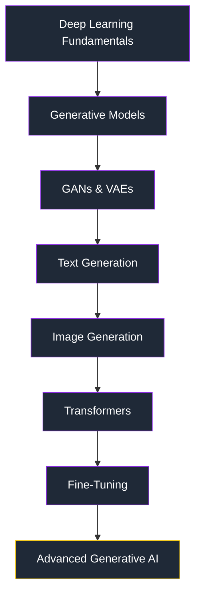
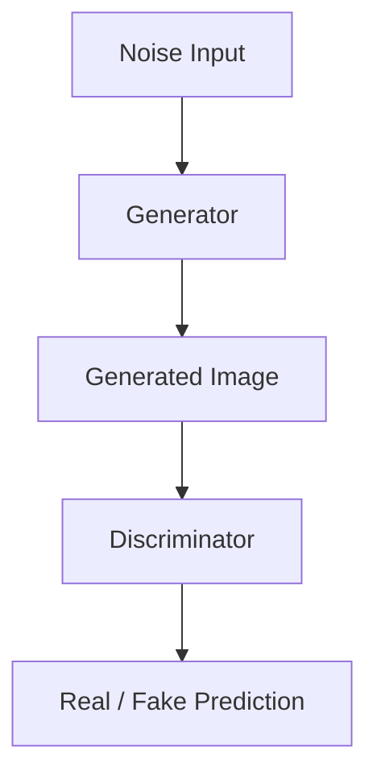
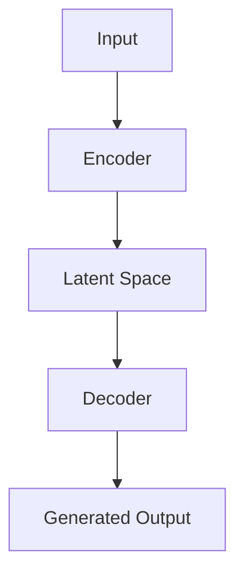
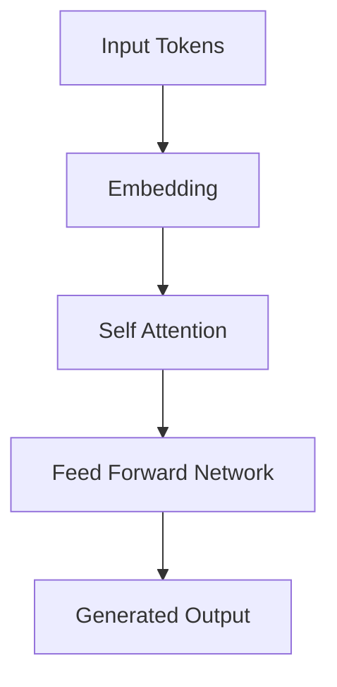

<div align="center">

# 🧠 Generative AI Learning Journey

### *A hands-on exploration of Generative AI architectures — from GANs and VAEs to Transformers and modern generative models.*

[](https://www.python.org/)
[](https://pytorch.org/)
[](https://huggingface.co/docs/transformers/index)
[](https://www.tensorflow.org/)
[](#)

</div>

---

## 📌 Introduction

This repository is a structured, hands-on record of my journey into **Generative AI** — the branch of machine learning concerned with models that create rather than merely classify or predict. It documents implementation-first work across the core generative paradigms: adversarial networks, variational models, sequence and text generation, image-to-image translation, and attention-based architectures that power today's large-scale generative systems.

Generative AI has moved from a research curiosity to the foundation of modern AI products — image synthesis, text generation, code generation, and multimodal assistants are all built on the architectural principles explored here. Understanding these foundations at the implementation level, rather than only at the API-call level, is what separates an engineer who can *use* generative models from one who can *build, debug, and extend* them.

**Learning objectives of this repository:**
- Build generative models from first principles rather than relying solely on high-level libraries
- Understand the mathematical and architectural intuition behind GANs, VAEs, and Transformers
- Translate theory into working, trainable implementations
- Explore real-world generation tasks: images, text, sequences, and style
- Build a foundation for advanced work in fine-tuning, diffusion, and agentic AI systems

**Approach:** Every module pairs a concept with a working implementation and a set of experiments — the emphasis throughout is on *understanding by building*, not tutorial-following.

---

## 🗺️ Learning Roadmap



---

## ✨ Repository Highlights

| Highlight | Description |
|---|---|
| 🔧 **Implementation from Scratch** | Core architectures (GANs, VAEs, attention layers) implemented at the tensor level, not just imported |
| 🧩 **Architecture Understanding** | Each module documents design decisions — loss functions, latent space design, layer choices |
| 🧪 **Hands-On Experiments** | Systematic experimentation with hyperparameters, architectures, and training stability techniques |
| 🖼️ **Image Generation** | GANs, Pix2Pix, and style transfer applied to real image synthesis tasks |
| ✍️ **Text Generation** | Sequence models and attention-based architectures for language generation |
| 🎯 **Model Fine-Tuning** | Adapting pre-trained generative models to custom tasks and datasets |
| 🔍 **Attention Mechanisms** | Deep dive into self-attention and its role in modern generative architectures |

---

## 📚 Complete Learning Modules

| Module | Concept | Implementation | Key Learning |
|---|---|---|---|
| Week 1 | Synthetic Data Generation | Statistical & noise-based data generation pipelines | Foundations of data distributions and generative sampling |
| Week 2 | Generative Adversarial Networks (GAN) | Generator–Discriminator adversarial training loop | Adversarial loss dynamics, mode collapse, training stability |
| Week 3 | Variational Autoencoders (VAE) | Encoder–latent space–decoder architecture | Probabilistic latent representations, reparameterization trick |
| Week 4 | Text Generation Models | RNN/LSTM-based sequence generators | Language modeling fundamentals, sequential prediction |
| Week 5 | Image-to-Image Translation | Conditional GAN-based translation | Mapping between image domains, conditional generation |
| Week 6 | Pix2Pix Networks | Paired image translation with U-Net generator | Supervised image translation, adversarial + reconstruction loss |
| Week 7 | Neural Style Transfer | CNN feature-based style/content separation | Perceptual loss, feature map manipulation |
| Week 8 | Neural Art Generation | Style transfer applied to artistic generation | Creative applications of representation learning |
| Week 9 | Sequence Generation Models | Sequence-to-sequence architectures | Encoder-decoder frameworks for structured generation |
| Week 10 | Sequential Data Generation | Autoregressive generation techniques | Temporal dependencies in generative modeling |
| Week 11 | Fine-Tuning Pre-trained Models | Transfer learning on generative backbones | Adapting large pre-trained models efficiently |
| Week 12 | Attention-Based Generative Models | Self-attention and Transformer blocks | Modern architecture foundations for scalable GenAI |

---

## 🧬 Generative AI Concepts Explained

### Generative Adversarial Networks (GAN)

A GAN consists of two competing networks trained in a minimax game:

- **Generator** — learns to map random noise into realistic synthetic samples
- **Discriminator** — learns to distinguish real samples from generated ones
- **Training Objective** — the generator tries to fool the discriminator while the discriminator tries not to be fooled, converging toward a Nash equilibrium
- **Applications** — image synthesis, data augmentation, super-resolution, image-to-image translation

### Variational Autoencoders (VAE)

A VAE learns a probabilistic mapping between data and a structured latent space:

- **Encoder** — compresses input data into parameters of a latent distribution (mean, variance)
- **Latent Space** — a continuous, structured space enabling smooth interpolation and sampling
- **Decoder** — reconstructs data from sampled latent vectors
- **Reconstruction** — trained via a combination of reconstruction loss and KL-divergence regularization

### Transformers

The architecture underpinning modern generative AI:

- **Attention Mechanism** — allows the model to weigh the relevance of different input elements dynamically
- **Self-Attention** — enables each token to attend to every other token, capturing long-range dependencies
- **Importance in Modern GenAI** — the backbone of large language models, vision transformers, and multimodal generative systems

### Diffusion Models

The generative approach behind state-of-the-art image synthesis:

- **Noise Addition** — a forward process progressively corrupts data with Gaussian noise
- **Reverse Denoising Process** — a learned model iteratively removes noise to reconstruct data
- **Modern Image Generation** — powers systems like Stable Diffusion, enabling high-fidelity, controllable image synthesis

---

## 🏗️ Architecture Diagrams

### GAN Architecture



### VAE Architecture



### Transformer Architecture



---

## 📁 Repository Structure

```
GenAI-Learning/
├── Week-1-Synthetic-Data/
├── Week-2-GAN/
├── Week-3-VAE/
├── Week-4-Text-Generation/
├── Week-5-Image-Translation/
├── Week-6-Pix2Pix/
├── Week-7-Style-Transfer/
├── Week-8-Neural-Art/
├── Week-9-Sequence-Models/
├── Week-10-Sequence-Generation/
├── Week-11-Fine-Tuning/
├── Week-12-Attention-Models/
└── README.md
```

Each weekly directory is self-contained, holding notebooks, scripts, and (where applicable) saved model checkpoints and sample outputs relevant to that module's concept. This structure keeps the learning progression traceable — from foundational data generation through to attention-based architectures.

---

## ⚙️ Setup Instructions

### Prerequisites

- Python 3.9+
- CUDA-enabled GPU (optional, recommended for training)
- Jupyter Notebook or JupyterLab

### Installation

```bash
git clone https://github.com/tanmaytyagii/GenAI-Learning.git
cd GenAI-Learning
pip install -r requirements.txt
```

### Running Notebooks

**Locally via Jupyter:**
```bash
jupyter notebook
```

**Or via Google Colab:** open any notebook directly through Colab's *GitHub* import tab using this repository's URL.

---

## 🖼️ Results Showcase

> Sample outputs, training curves, and generated artifacts will be added here as each module is completed.

| Category | Preview |
|---|---|
| Generated Images | _placeholder — add sample GAN/Pix2Pix outputs_ |
| Training Curves | _placeholder — add loss/accuracy plots_ |
| Model Outputs | _placeholder — add VAE reconstructions_ |
| Sample Generations | _placeholder — add text/style-transfer samples_ |

---

## 🛠️ Skills Demonstrated

**Machine Learning**
- Deep Learning
- Neural Network Design
- Generative Modeling

**Generative AI**
- GANs
- VAEs
- Transformers
- Diffusion Models
- Fine-Tuning

**Frameworks & Tools**
- PyTorch
- Hugging Face Transformers
- NumPy, Pandas, Matplotlib, Seaborn

---

## 🚀 Future Roadmap

- [ ] Large Language Model (LLM) fine-tuning
- [ ] LoRA / QLoRA parameter-efficient fine-tuning
- [ ] Retrieval-Augmented Generation (RAG)
- [ ] Stable Diffusion experimentation
- [ ] Multimodal generative models (text + image)
- [ ] Agentic AI workflows

---

## 📖 Learning Resources

- **Research Papers:** _placeholder — add key papers (GAN, VAE, Attention Is All You Need, DDPM, etc.)_
- **Documentation:** _placeholder — PyTorch, Hugging Face Transformers, Diffusers docs_
- **Courses:** _placeholder — relevant Generative AI / Deep Learning courses_

---

## 👤 Author

**Tanmay Tyagi**
B.Tech Computer Science Engineering (AI/ML)

[](https://github.com/tanmaytyagii)
[](https://linkedin.com/in/tyagitanmay)

---

<div align="center">

### ⭐ If this repository helped you understand Generative AI, consider giving it a star!

</div>
